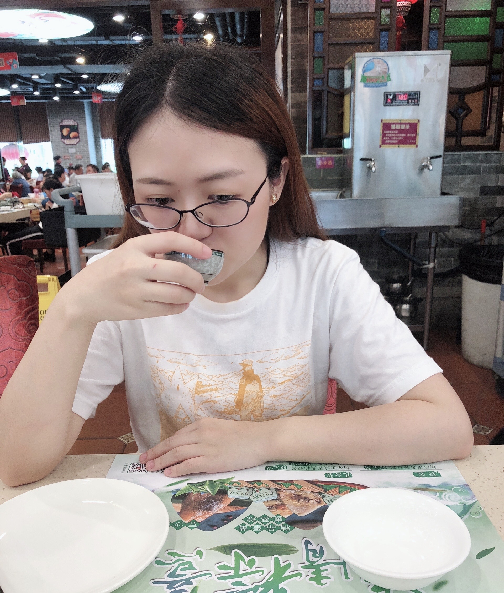

<h1>Yu Cai</h1>

<h3 style="color:grey;"> <i>Cornell University</i></h3>

 

 

I obtained a BA in Mathematics and Economics from Hobart and William Smith Colleges in 2017. Then I worked one year as the only Math Intern in Math department at Hobart and William Smith Colleges. I recently joined the Cornell University with a MS in Biostatistics and Data Science in 2018.

My full CV is available [here](files/Yu_Cai_CV.pdf).